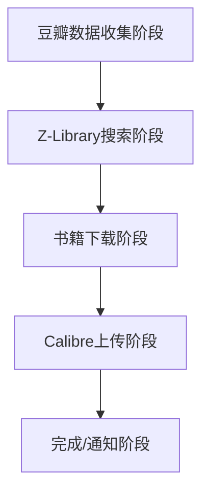
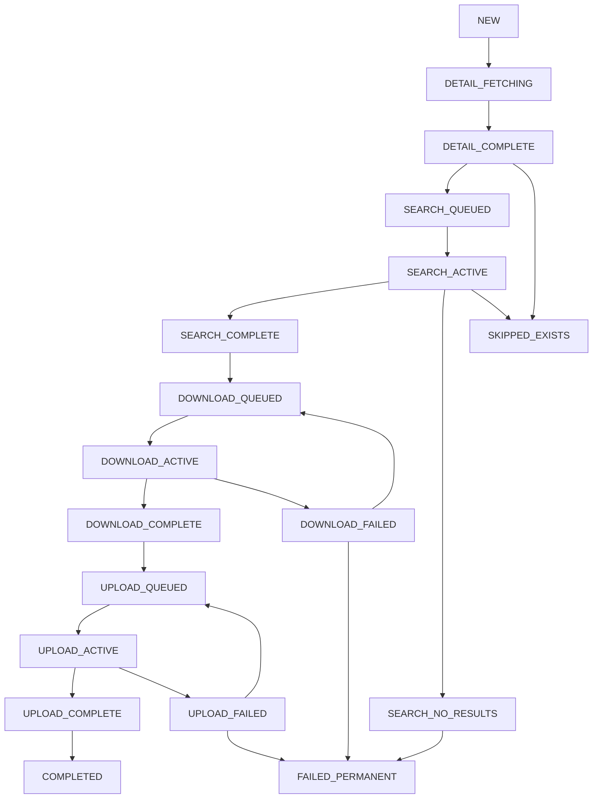

# 自动书籍管理系统 - 系统概览

## 项目简介

这是一个基于Pipeline架构的自动化书籍同步工具，能够从豆瓣想读书单抓取书籍信息，通过Z-Library下载电子书，并自动上传到Calibre书库进行管理。

## 核心功能

### FR-001: 豆瓣数据抓取
- 支持通过Cookie认证访问豆瓣个人书单
- 自动提取书籍标题、作者、ISBN、评分等元数据
- 增量更新机制，避免重复处理

### FR-002: Z-Library搜索下载
- 智能搜索匹配算法，支持模糊匹配
- 多格式支持（EPUB、MOBI、PDF）优先级下载
- 代理池支持，提高下载成功率
- 断点续传和重试机制

### FR-003: 格式优先级
- 可配置的文件格式优先级（默认：epub > mobi > pdf）
- 自动选择最佳格式进行下载
- 支持多格式并存

### FR-004: Calibre集成
- 自动上传到指定Calibre书库
- 元数据同步和补全
- 书库管理API集成

### FR-005: 状态管理
- 19状态精细化生命周期管理
- 完整的状态转换验证
- 状态历史记录和回滚机制

### FR-006: 重复检测
- Calibre书库重复检测，避免重复下载
- 可配置的相似度匹配阈值
- SKIPPED_EXISTS状态标记

### FR-007: 错误处理
- 分类错误处理（网络、认证、资源等）
- 指数退避重试策略
- 错误恢复和任务回滚
- 详细错误日志记录

### FR-008: 任务调度
- 可配置的定时同步（日/周/间隔）
- 优先级队列任务调度
- 并发控制和资源管理

### FR-009: 监控通知
- 飞书(Lark)集成通知
- 实时状态更新推送
- 错误告警机制

### FR-010: 数据持久化
- SQLite/PostgreSQL数据库支持
- 完整的书籍元数据存储
- 状态历史和操作日志

### FR-011: 配置管理
- YAML格式配置文件
- 环境变量支持
- 热配置重载

## 系统架构

### Pipeline架构设计

系统采用分阶段Pipeline架构，每个阶段负责特定的处理逻辑：



### 核心组件

#### 1. 主应用 (main_v2.py)
- Pipeline架构的入口点和编排器
- 支持 `--once`, `--daemon` 模式
- 豆瓣403错误智能处理

#### 2. 核心Pipeline系统 (core/)
- **BookStateManager**: 统一状态管理，19种精细化状态
- **TaskScheduler**: 优先级队列任务调度
- **PipelineManager**: 分阶段处理管理器
- **ErrorHandler**: 分类错误处理和恢复

#### 3. Pipeline阶段 (stages/)
- **DataCollectionStage**: 豆瓣数据收集
- **SearchStage**: Z-Library搜索
- **DownloadStage**: 书籍文件下载
- **UploadStage**: Calibre上传

#### 4. 数据模型 (db/models.py)
- **DoubanBook**: 豆瓣书籍实体
- **BookStatus**: 19种状态枚举
- **BookStatusHistory**: 状态变更历史
- **ProcessingTask**: 任务调度记录
- **ZLibraryBook**: Z-Library搜索结果

#### 5. 服务层 (services/)
- **DoubanScraper**: 豆瓣爬虫服务
- **ZLibraryService**: Z-Library集成
- **CalibreService**: Calibre书库管理
- **LarkService**: 飞书通知服务

#### 6. 配置和工具
- **ConfigManager**: YAML配置管理
- **Logger**: 结构化日志系统
- **Database**: 数据库会话管理

## 19状态生命周期

### 数据收集阶段 (3个状态)
- `NEW`: 豆瓣新发现的书籍
- `DETAIL_FETCHING`: 正在获取豆瓣详细信息
- `DETAIL_COMPLETE`: 详细信息获取完成

### 搜索阶段 (4个状态)
- `SEARCH_QUEUED`: 排队等待Z-Library搜索
- `SEARCH_ACTIVE`: 正在搜索Z-Library
- `SEARCH_COMPLETE`: 搜索完成，找到匹配结果
- `SEARCH_NO_RESULTS`: 搜索完成，无匹配结果

### 下载阶段 (4个状态)
- `DOWNLOAD_QUEUED`: 排队等待下载
- `DOWNLOAD_ACTIVE`: 正在从Z-Library下载
- `DOWNLOAD_COMPLETE`: 下载完成
- `DOWNLOAD_FAILED`: 下载失败

### 上传阶段 (4个状态)
- `UPLOAD_QUEUED`: 排队等待上传到Calibre
- `UPLOAD_ACTIVE`: 正在上传到Calibre
- `UPLOAD_COMPLETE`: 上传完成
- `UPLOAD_FAILED`: 上传失败

### 终态 (3个状态)
- `COMPLETED`: 整个流程成功完成
- `SKIPPED_EXISTS`: 在Calibre中已存在，跳过处理
- `FAILED_PERMANENT`: 永久失败，不再重试

### 完整流程图



## 特殊处理机制

### 豆瓣403错误处理
- 保留当前书籍状态，延后重试
- 继续处理已获取详情的书籍
- 智能退避策略避免频繁请求

### 重复检测机制
- Calibre书库存在性检查
- 基于标题/作者的模糊匹配
- 可配置匹配阈值（默认0.6）

### 错误恢复机制
- 网络错误：指数退避重试
- 认证错误：标记需要人工干预
- 资源错误：永久失败标记
- 系统错误：回滚到安全状态

## 技术栈

### 核心技术
- **Python 3.11+**: 主要开发语言
- **SQLAlchemy 2.0**: ORM和数据库抽象
- **SQLite/PostgreSQL**: 数据存储
- **Requests + BeautifulSoup4**: 网页爬取
- **Schedule**: 定时任务调度
- **PyYAML**: 配置文件解析
- **Loguru**: 结构化日志

### 测试和质量
- **Pytest**: 测试框架
- **Coverage**: 代码覆盖率
- **Mock**: 测试模拟
- **Yapf**: 代码格式化
- **Isort**: Import排序
- **Flake8**: 代码检查
- **MyPy**: 静态类型检查

## 部署和运维

### 运行模式
- **一次性模式**: `python main.py --once`
- **守护进程模式**: `python main.py --daemon`
- **清理模式**: `python main.py --cleanup`

### 配置文件
- 主配置：`config.yaml`
- 验证配置：`config.validation.yaml`
- 日志配置：内置在主配置中

### 数据目录
- `data/`: 数据库和下载文件
- `logs/`: 日志文件
- `tests/`: 测试用例和验证脚本

### 监控和运维
- 结构化日志输出到文件和控制台
- 飞书通知集成，实时状态更新
- 数据库备份和迁移支持
- 错误统计和性能指标

## 开发和维护

### 开发命令
```bash
# 运行测试
python run_tests.py
pytest tests/

# 代码质量检查
yapf -r -i .
isort .
flake8 .
mypy .

# 项目设置
python setup.py
```

### 测试结构
- `tests/unit/`: 单元测试
- `tests/integration/`: 集成测试
- `tests/validation/`: 功能验证测试
- `tests/fixtures/`: 测试数据和fixtures

### 扩展指南
- 添加新的Pipeline阶段
- 扩展状态管理系统
- 集成新的书籍来源
- 添加新的通知渠道

## 性能和扩展

### 性能特征
- 支持并发处理多个书籍
- 数据库连接池管理
- 智能重试避免资源浪费
- 内存优化的大量数据处理

### 扩展性设计
- 模块化Pipeline架构
- 插件式服务扩展
- 配置驱动的行为定制
- 数据库抽象支持多种存储后端

### 限制和约束
- 豆瓣反爬虫限制
- Z-Library API限制
- Calibre服务器性能限制
- 网络带宽和存储空间

## 许可和贡献

本项目采用开源许可证，欢迎社区贡献。

### 贡献指南
1. Fork项目并创建特性分支
2. 添加必要的测试用例
3. 确保所有测试通过
4. 遵循代码风格规范
5. 提交Pull Request

### 问题报告
- 使用GitHub Issues报告问题
- 提供详细的复现步骤
- 包含相关的日志信息
- 标明环境和版本信息