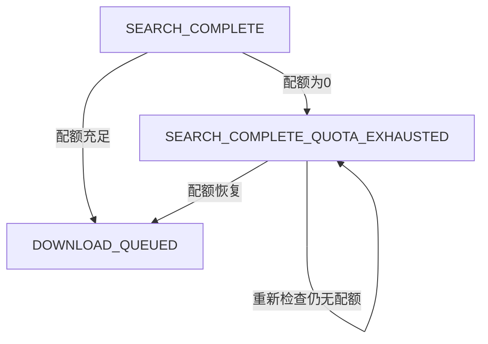

# Data Model: 0次下载时跳过下载任务

## Overview
扩展现有数据模型以支持下载配额感知处理，主要涉及BookStatus状态扩展和配额管理实体。

## Entity Extensions

### 1. BookStatus 枚举扩展
**现有状态**: 19种精细化状态  
**新增状态**: `SEARCH_COMPLETE_QUOTA_EXHAUSTED = "search_complete_quota_exhausted"`

```python
class BookStatus(str, Enum):
    # ... 现有状态 ...
    SEARCH_COMPLETE = "search_complete"
    SEARCH_COMPLETE_QUOTA_EXHAUSTED = "search_complete_quota_exhausted"  # 新增
    SEARCH_NO_RESULTS = "search_no_results"
    # ... 其他状态 ...
```

**状态语义**: 
- 搜索阶段完成，找到可下载资源
- 但由于下载配额为0而跳过下载阶段
- 等待配额恢复后重新进入下载队列

**状态转换规则**:
```
SEARCH_COMPLETE → SEARCH_COMPLETE_QUOTA_EXHAUSTED (配额不足时)
SEARCH_COMPLETE_QUOTA_EXHAUSTED → DOWNLOAD_QUEUED (配额恢复时)
```

### 2. DownloadQuota 实体 (新增)
**用途**: 管理和缓存Z-Library下载配额信息

```python
@dataclass
class DownloadQuota:
    remaining_downloads: int
    daily_limit: int = 10
    last_checked: datetime
    next_reset: Optional[datetime] = None
    
    def has_quota_available(self) -> bool:
        return self.remaining_downloads > 0
    
    def is_expired(self, cache_minutes: int = 5) -> bool:
        return datetime.now() - self.last_checked > timedelta(minutes=cache_minutes)
```

**字段说明**:
- `remaining_downloads`: 当前剩余下载次数
- `daily_limit`: 每日下载限制 (默认10)
- `last_checked`: 最后检查时间
- `next_reset`: 配额重置时间 (可选)

### 3. ProcessingTask 扩展
**现有实体**: TaskScheduler使用的任务实体  
**新增字段**: `requires_quota: bool = False`

```python
@dataclass 
class ProcessingTask:
    # ... 现有字段 ...
    requires_quota: bool = False  # 新增：标识任务是否需要下载配额
```

**用途**: 
- 区分需要配额和不需要配额的任务
- 支持配额不足时的任务调度决策

## State Machine Extensions

### 新增状态转换



### 状态验证规则
1. `SEARCH_COMPLETE_QUOTA_EXHAUSTED` 只能从 `SEARCH_COMPLETE` 转换而来
2. `SEARCH_COMPLETE_QUOTA_EXHAUSTED` 可以转换到 `DOWNLOAD_QUEUED` (配额恢复)
3. `SEARCH_COMPLETE_QUOTA_EXHAUSTED` 可以转换到 `FAILED_PERMANENT` (永久失败)

## Database Schema Changes

### BookStatus 枚举更新
```sql
-- 新增枚举值 (SQLAlchemy自动处理)
ALTER TYPE bookstatus ADD VALUE 'search_complete_quota_exhausted';
```

### 索引优化
```sql
-- 为新状态创建索引，优化配额恢复查询
CREATE INDEX idx_books_quota_exhausted 
ON douban_books (status) 
WHERE status = 'search_complete_quota_exhausted';
```

## Validation Rules

### BookStatus 验证
1. 新状态必须有对应的处理逻辑
2. 状态转换必须符合定义的转换规则
3. 不允许跳跃式状态转换

### DownloadQuota 验证
1. `remaining_downloads` 不能为负数
2. `last_checked` 必须是有效的datetime
3. `daily_limit` 必须大于0

### ProcessingTask 验证  
1. 标记为 `requires_quota=True` 的任务必须在配额检查后执行
2. 配额不足时，需要配额的任务应该被延期或跳过

## Data Consistency

### 并发控制
- 配额检查和状态更新必须在同一事务中
- 避免竞态条件导致的配额超用

### 数据完整性
- 确保状态转换的原子性
- 保持BookStatusHistory的完整记录

## Performance Considerations

### 查询优化
1. 为新状态添加数据库索引
2. 配额查询结果短时间缓存 (5分钟)
3. 批量状态更新减少数据库操作

### 内存使用
- DownloadQuota对象轻量化设计
- 避免长时间缓存大量配额信息

## Migration Strategy

### 数据迁移
1. 新增枚举值 (向后兼容)
2. 无需迁移现有数据
3. 新状态仅用于新的处理流程

### 代码迁移
1. 扩展StateManager支持新状态
2. 更新DownloadStage处理逻辑
3. 增加相应的测试用例